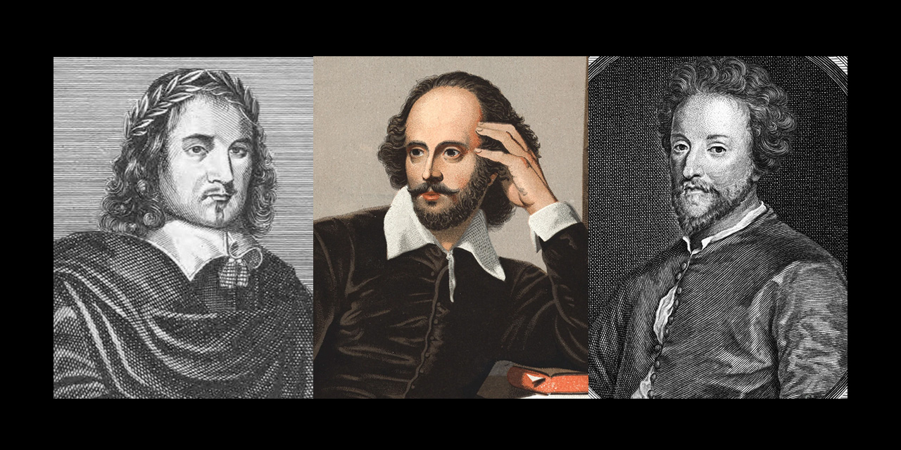
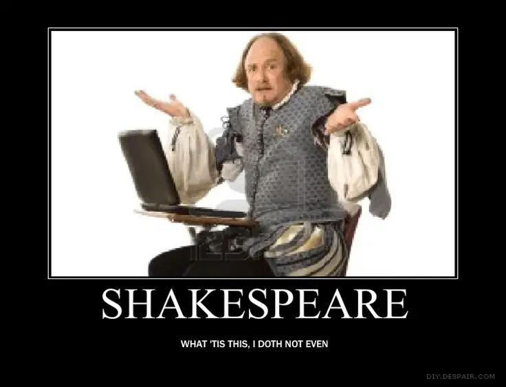

# To be.... or not?

Welcome historians, students, admirers and fans of the theatre. For my final project in th Flatiron Data Science program, I have created a model that can be used to distinguise the identity of an author of an Elizabethan/Jacobean play between William Shakespeare, Thomas Middleton, and John Fletcher. 

In this project description, we will cover:

* [***Project Overview:***](#project-overview) The project goal, audience, and datasets
* [***Basic Walkthrough:***](#Walkthrough) The basics of what I did during the project
* [***Final Model***](#final_model) Final model chosen based on overall accuracy
* [***Findings:***](#findings) Projected findings using said models
* [***Business Recommendations:***](#busrec) Recommendations based on model findings
* [***What's Next:***](#next) What I'd like to do to improve further

Before we get started, here is a linksto navigate this project:
* [The notebook](https://github.com/evamizer/to-be-or-not/blob/main/to-be-or-not.ipynb)

## Project Overview

For this project, I used exploratory data analysis, data cleaning and preparation, and modeling to generate insights for a business stakeholder.

### Business Problem

#### Stake Holders:
* Literary historians looking to confirm authoriship or assign authoriship of a play of Elizabethan or Jacobean era

#### Busniess Problem/Solution:
*  The Elizabethan and Jacobean eras had a distinct lack of copyright law, leading to playwrites being very guarded of their work, often shrouding them in secrecy and causing copies of the plays to be hard to come by, and some to be lost completely.

*  Over time, some plays were copied/edited, some lost and refound, and some sometimes even lost their entire attribution so no one really knows who actually wrote it.

* Authors occasionally worked together, but their exact contributions were not always clear.

### The Datasets

The data we are using is a combination of three sets of plays, one from each of three prominant playwrites of the day. 

* For Shakespeare, we are using a [csv](https://www.kaggle.com/datasets/kingburrito666/shakespeare-plays) of all of known Shakespearean plays availabe up on Kaggle submitted by Liam Larsen. We will make a subset for the play "Much Ado About Nothing" from 1598/99.
* For Thomas Middleton, we will be using his comedic play ["A Chaste Maid in Cheapside"](https://tech.org/~cleary/chast.html) released in 1613.
* For John Fletcher, we will be using his tragic comedy ["The Faithful Shepherdess"](https://www.luminarium.org/sevenlit/fletcher/fletchbib.htm) released in 1609.

#### Features Used:
* **author:** int64, author code (0=Shakespeare, 1=Fletcher, 2=Middleton)
* **text:** Object, line spoken

## Basic Walkthrough

* **Exploring the data**: Sizing up the data, checking for class balance, checking for any anomolies in the data
* **Cleaning/Preprocesing the data**: We remove capitalization, line breaks, punctuation, stopwords, a modified list of era-appropriate stopwords, and numbers, then either stemmatize or lemmatize.
* **Feature Engineering**: We will be calculating punctuation and line length, making uni and bigrams, and Word2Vec Embeddings to use in our different models later.
* **Models**: I tried out a couple different models (Random Forest, Naive Bayes, and Support Vector Classifier (SVC)) after establishing a baseline naive model, adding in analysis for each one and trying out different ways to improve their results. We used GridSearchCV for each model to find the most optimal hyperparameters.
* **Final Model Selection**: Review the model I selected and explain why I chose it. 
* **Production of App**: Produce an app with Gradio for users to try out. 
* **Business Recommendations** - Implimentation and uses. 
* **Going Further**: Relfections on how I would improve my process, adapt for use in other applications/other uses, etc.

## Final Model

After running a few models mentioned above, I chose Multinomial Naive Bayes (MNB) based on it's overall accuracy and low bias for any individual author. 

## Business Recommendations 

**Basic Use Function**

When receiving a new document or revisiting an older document to review or determine authorship, one can simply copy a few lines into the prompt and the model will give it's best guess which author wrote the lines.

**Recommendation**

Here are some tips for getting the most out of this model for the purposes of author identification between the three authors:

*  While a few lines may suffice, test as much text as possible
*  When determing authorship of parts of a document, test one part of the document at a time, expanding the search as necessary (first testing a group of lines, then paragraphs, and scenes)
*  As needed, you can test an entire play as a whole
*  While this model can be useful for determining which author likely wrote the text, it is important to note that text written by an author not included in this model, but possessing the same style as one of the authors the model trained on, will result in the model classifying it as the author with the most similar style.

## What's Next

**Improvement** 

Because this model only looked at one play for each playwrite, I can see how it would struggle with other types of plays, like tragedies or historical works, which might expand on a different vocaulary and word combinations than a comedy. Even with comedies, only having such a limited source of words and word combinations could pose a problem. In my testing with random phrases and acts from "Merchant of Venice", the model would routinely consider phrases or sections as belonging to John Fletcher.

I have to wonder if adding plays of multiple genres would increase the accuracy, or if adding more works (both comedy and otherwise) would be better. I would guess that vocabulary plays a part, but how they use the words might be more pertinant (think bigrams).

**Adaptation**

I wonder if we could hook this model up into a function that would churn through plays line by line (or chunks of a given size) to automate the analysis and return info on the authorship prediction for various parts of the play, or even the play as a whole.

I would like to explore more plays from Shakespeare and see how his own style changed over the course of his career and how that might affect the model. Furthermore, I would love to try the modeling again comparing the three authors (or maybe just two), but include two or more of their works rather than just one. I feel this would expand the vocabulary, but also give a more well-rounded view of their usual style.

**Other Uses**

I would like to see if there is an easy way to adjust the input training/testing dataset that would allow for the model to test other authors of other works of writing. Outside of academic and literature conservation, this could be used to help solve court cases for copyright, identify ghost writers or true authors of books written by pen names.

Lastly, thank you for taking the time to read through this, and I hope it helped inform and awaken your curiosity!

## Non-Technical Presentation
* [Here you will find my slideshow presentation](https://github.com/evamizer/to-be-or-not/blob/d4503af9bea298020600df9cf9446010ca99047d/to-be-or-not.pdf)

 ## Repository Structure:
 *Please note that I have added some copies of images found in the presentation and/or notebook*

    ├── data
        └── chaste_maid_middleton.csv
        └── shakespeare_data.csv
        └── shepherdess_fletcher.csv
    ├── images
        └── court.jpg
        └── emtest.jpg
        └── fletcher-dist.jpg
        └── frequency.png
        └── gradio.png
        └── middleton-dist.jpg
        └── repository-shakes-social.jpg
        └── shakes-dist.jpg
        └── shakes.jpg
        └── sheep.jpg
        └── whatdoththis.jpg
    ├── model
        └── nb_model.pkl
        └── nb_word_list.pkl
        └── new_empty_df.pkl
        └── word2vec_model.pkl
     ├── .gitignore
     ├── README.md
     ├── to-be-or-not.ipynb
     └── to-be-or-not.pdf
